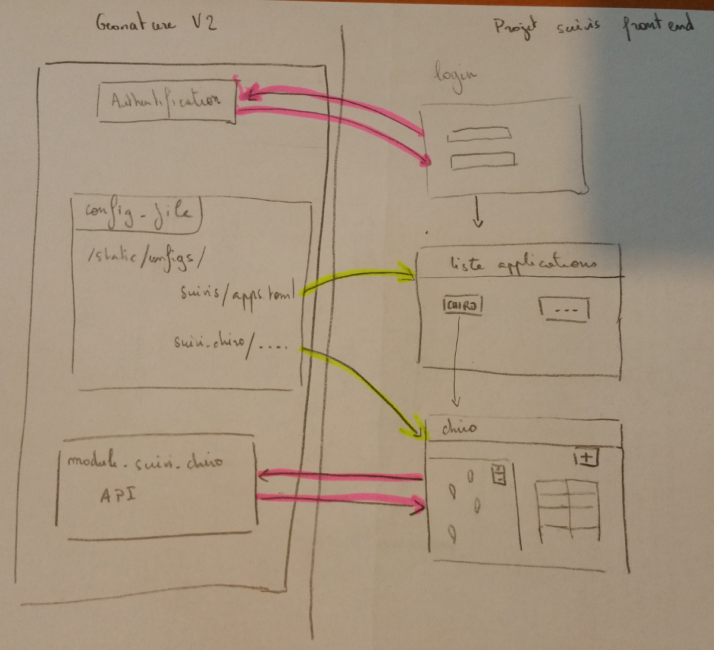

# Front end du Projet application suivis

Application de saisie des protocoles de suivi naturaliste qui fonctionne avec [GeoNature](https://github.com/PnX-SI/GeoNature) comme backend ainsi qu'un module GeoNature dédié à un protocole comme celui pour le [Suivi des chiroptères](https://github.com/PnCevennes/gn_module_suivi_chiro).


Documentation
------------
Ebauche de schema représentant l'articulation entre geonature v2 et l'application



Prerequis
---------
Avoir un [GeoNature](https://github.com/PnX-SI/GeoNature)  installé

apache2

Installation
------------

copier le fichier config/settings.ini.sample et 

```
  cp config/settings.ini.sample config/settings.ini
  nano config/settings.ini
```

lancer le script d'installation

```
./install.sh

```


Configuration
-------------

* Ajouter/ modifier une application : modifier le fichier config/apps.toml


Technologies
------------

- Langages : HTML, JS, CSS
- Framework JS : Angular JS
- Framework carto : Leaflet
- Framework CSS : Bootstrap
- Fonds rasters : Geoportail, OpenStreetMap, Google Maps, WMS


Aperçu
------


*Liste des sites*


*Fiche d'une visite*


*Formulaire de saisie d'une observation chiro lors d'une visite d'un site*


Auteurs
-------

Parc national des Cévennes

* Frédéric FIDON
* Amandine SAHL


License
-------

* OpenSource - GPL V3
* Copyleft 2015 - Parc national des Cévennes


